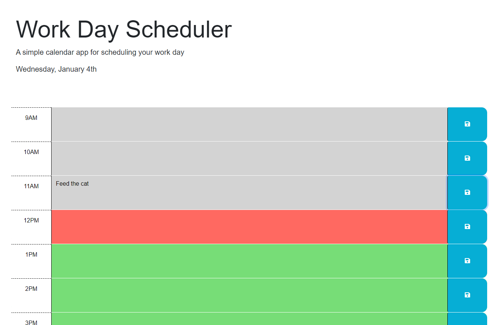

# Work Day Scheduler

I started this project with some starter code.  I worked with jQuery to make all the changes and for the app to function according to the user story and acceptance criteria.  

## Links
Deployed Website: https://erinsawyer504.github.io/green-work-day-scheduler/

Github Repo: https://github.com/erinsawyer504/green-work-day-scheduler

## User Story

```md
AS AN employee with a busy schedule
I WANT to add important events to a daily planner
SO THAT I can manage my time effectively
```

## Acceptance Criteria

```md
GIVEN I am using a daily planner to create a schedule
WHEN I open the planner
THEN the current day is displayed at the top of the calendar
WHEN I scroll down
THEN I am presented with timeblocks for standard business hours
WHEN I view the timeblocks for that day
THEN each timeblock is color coded to indicate whether it is in the past, present, or future
WHEN I click into a timeblock
THEN I can enter an event
WHEN I click the save button for that timeblock
THEN the text for that event is saved in local storage
WHEN I refresh the page
THEN the saved events persist
```

The following image demonstrates the application functionality:





© 2022 Trilogy Education Services, LLC, a 2U, Inc. brand. Confidential and Proprietary. All Rights Reserved.
